# 网络分层

- 可分为**5**层：物理层，链路层、网络层、传输层和应用层
  - 代表性的职责：
    - 接收上一层数据
    - 通过添加头部和尾部对数据进行封装
    - 将数据转发到下一层做进一步传输
    - 接收下一层传输而来的数据
    - 去掉报头，解封装传输来的数据包
    - 将数据转发到上一层做进一步处理。

## 物理层

- 网络中计算机或主机提供的物理连接。

## 链路层

- 数据传输单元为**帧**。
- 职责：
  - 定义**主机的唯一标识**，方便帧数据对接收方进行编址
  - 定义**帧的格式**，包括目的地址的格式和所传输数据的格式
  - 定义**帧的长短**，以便确定上层每一次传输所能发送的数据大小。
  - 定义一种将帧转换为电子信号的物理方法。
- 链路层的数据传输并不可靠。

### Ethernet

- Ethernet 是与游戏开发工作者联系最为紧密的链路层协议族，基于 IEEE 802.3，用于光纤、双绞线或者铜轴电缆。

#### MAC Address

- 为了给主机唯一标识，以太网引入了**介质访问控制地址**(media access control address) 的概念。 Mac 地址理论上是一个 48 bit数字，唯一分配给链接在以太网网络中的每一个硬件。每一个 Mac 地址对应一个网卡。 前 24 bit 作为组织唯一标识符 (organizationally unique identifier, OUI)，后面 24 bit 是厂家自己分配。

#### Frame Format

- 对于每个数据包，其**前导序列 (preamble)** 和**帧开始标志(start frame delimiter,SFD)** 都是一样的。包含十六进制值 **0x55 0x55 0x55 0x55 0x55 0x55 0x55 0xD5** （64 bits 8 bytes）。 网卡会将前导序列和帧开始标志从数据包中剥离，剩下的字符被传递到以太网模块进行处理。

- 帧长度 / 类型域 （Length / Type）表示帧的长度或者类型的共用的域。以太网标准规定帧内封装的保温数据最大长度为 (1500 bytes)，也叫做**最大传输单元 (maximum trasmission unit MTU)**。 以太网标准还定义了 以太网类型的最小值为 0x0600 1536 ，所以如果 Length/Type 取值小于等于 1500 则标识帧长度，否则则是协议类型。

- FCS 帧检验序列是两个地址，帧长度/类型，数据和其他填充信息生成的循环冗余检验 CRC32 值。

### 网络层

- 链路层不支持将互联网划分更小的局域网络， 每个帧都将到达所有机器。也不能将网络区域划分成安全区域。
- 不同链路层之间由于协议不同不能通信。
- 网络层在链路层之上提供一套逻辑地址和基础设置，主机群可以划分为子网，两个遥远的子网中的主机可以使用不同的链路层协议和物理介质相互发送信息。

#### IP Address 和 数据包结构。

- IP 地址为 4个Bytesz，每个 Byte 之间通过英文句号隔开。刨除“网络地址转换”，IP 地址具有唯一性。

- **版本号（Version）**：长度 4 bits，对于 IPv4，该取值为4。
- **IP数据包的包头长度（Header Length）**：长度 4 bits，描述 IP 包头的长度。因为 IP 包头中有可选项，所以 IP 数据包的包头是可变的。其中单位长度是 32 bits 4 bytes， 也就是最长可以有 15 * 4 = 60 bytes的长度。因为至少有 20 bytes 的基础数据，所以 IP 包长度至少为 5 unit。
- **服务类型（Type of services）**：长度为 8 bits，用于从拥塞控制到差异化服务识别的各种目的。
- **IP数据包的包总长（Total Length）**：长度为 16 bits 即 2 bytes, 最大标识 65535 bytes（包含头部和数据两个部分）， 由于 IP 数据包已经最少为 20 bytes 所以这个数据包中数据部分最大长度为 65515 bytes。
- **片标识符（Fragment identification，16 bits），片标记（Fragment Flag ， 3 bits）和片偏移（Fragment Offset ， 13 bits）**：用于重组分片数据包，共计4 bytes。
  - 链路层 MTU 最大传输单位是 1500 byte 而一个 IP 数据包的大小最大可以是 65535 bytes， 这个时候就必须对 IP 数据包进行分割层最大传输单元的小片段。

